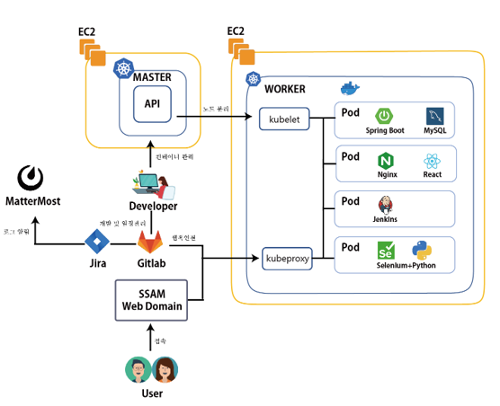

## SSAFY MANAGER SSAM

> 야구의 황금기를 대찾자~ MZ세대들과 함께~

## 📌 Intro

### 서비스 배경

- 코로나 이슈가 아니여도 점점 식어가는 야구의 인기..

- MZ 세대들은 보는 스포츠보다는 하는스포츠를 더선호..

- 야구의 전성기도 되찾고 MZ세대들에게 컨텐츠를 제공하는 야구 시뮬레이션 플랫폼으로 두마리의 토끼를 다 잡자!

### 서비스 목표

#### 나만의 라인업을 통해 야구 시뮬레이션을 진행하고 야구 신규 팬의 유입을 활성화

 

## ✨ 환영 한림주택 !

> ### 저희팀은 다음과 같이 분배했습니다.

|  이름  | 직책 |         역할          |                                    세부 역할                                     |
| :----: | :--: | :-------------------: | :------------------------------------------------------------------------------: |
| 노문택 | 팀장 |        Backend        |                   CI/CD & User Api develop (With JWT&Security)                   |
| 송민주 | 팀원 |  Backend & Frontend   | 게시판 API (Backend) 및 게시판 구성 (Frontend) & 메인화면 (경기일정 : Frontend ) |
| 이재영 | 팀원 |        Backend        |                         Player & Schedule API & Crawling                         |
| 조성한 | 팀원 |       Frontend        |     UserCustomTeam(나만의 팀) & PlayerArchives(선수 기록보관소) & UserManage     |
| 이정환 | 팀원 |  Frontend & Backend   | 게시판 API (Backend) 및 게시판 구성 (Frontend) & 시뮬레이션 JS 변환 및 연동구현  |
| 윤홍림 | 팀원 | Frontend & Simulation |                 Simulation 개발 및 Frontend 시뮬레이션 연동구현                  |

## 💻Stack

#### Front

#### Backend

 
 

#### DB

#### DevOps

## 🌏Distribution flow

---

22.04.26 moontek 추가..
backend 파일 나중에 conflict 날수도있어서 지워놧습니당..
