# 시연 시나리오

### 📌 야구시뮬레이션 플랫폼

------

#### 1. 메인 화면

메인 화면 경기 일정 및 차주의 일정을 확인할수있습니다.

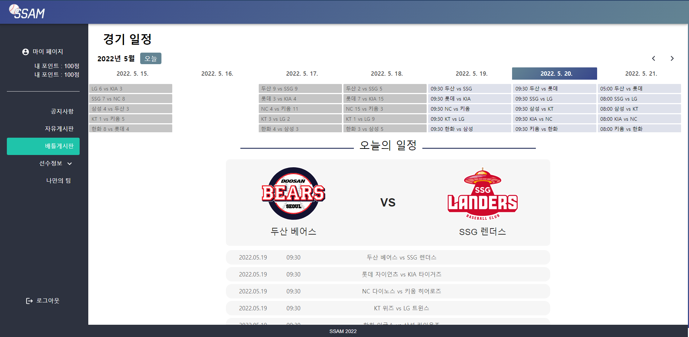

#### 2. 게시판 CRUD

> 공자사항 리스트

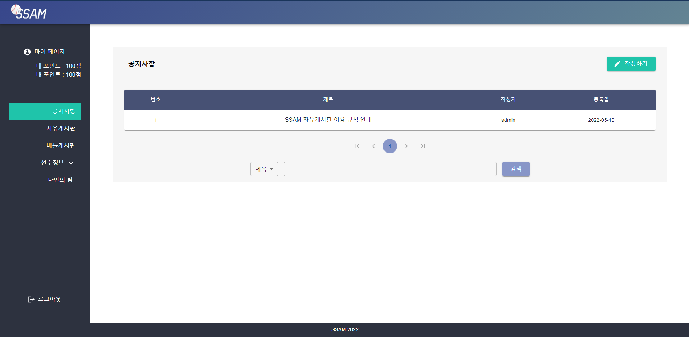

> 공지사항 생성

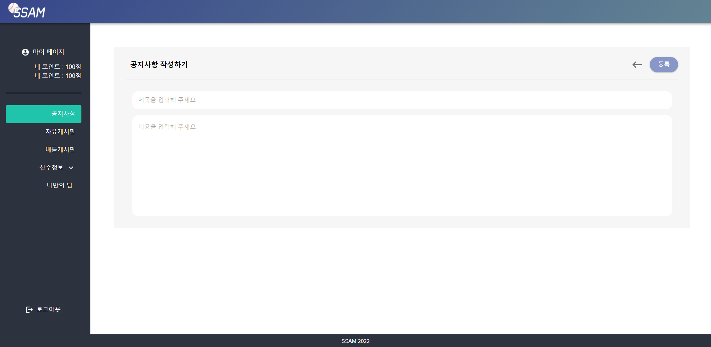

> 공지사항 확인

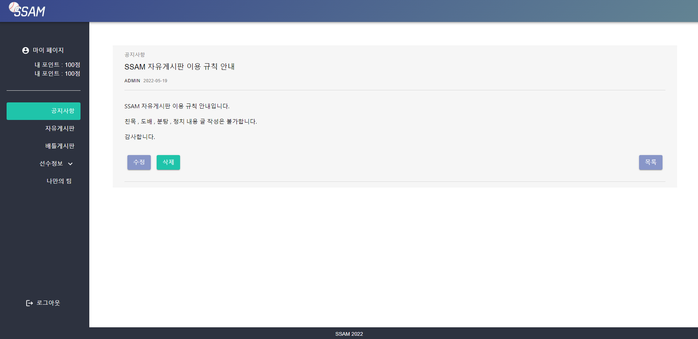

> 자유게시판 리스트

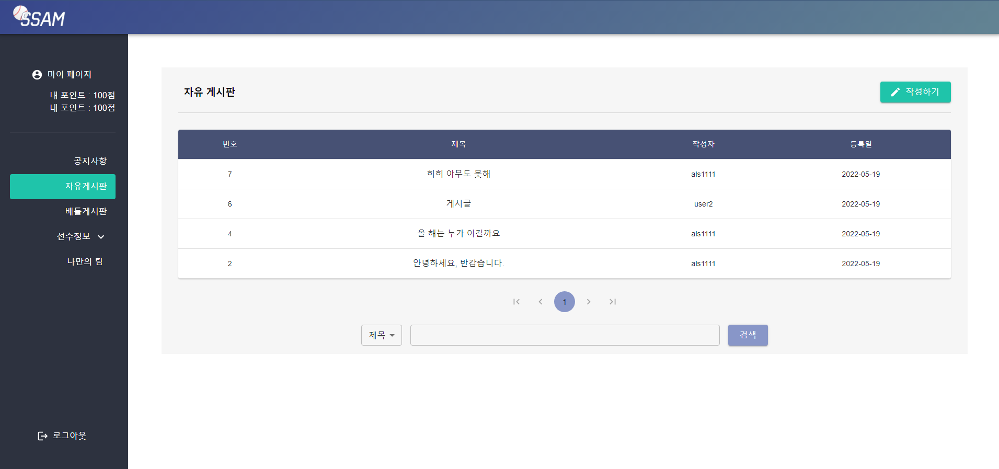

> 자유게시판 생성

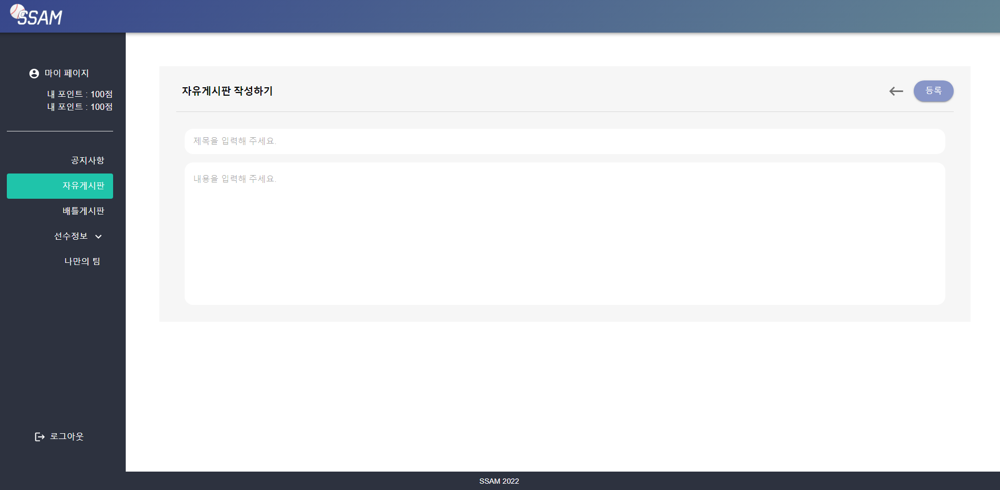

> 자유게시판 확인

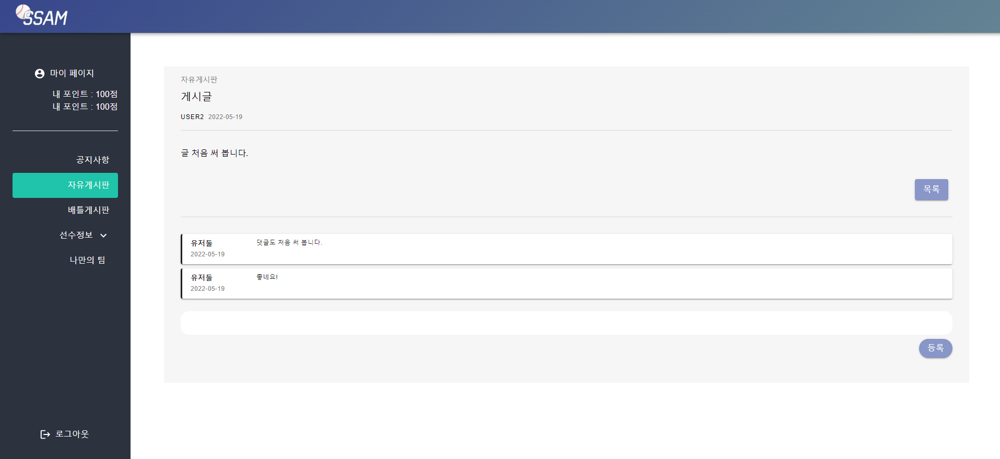

>  배틀게시판 리스트

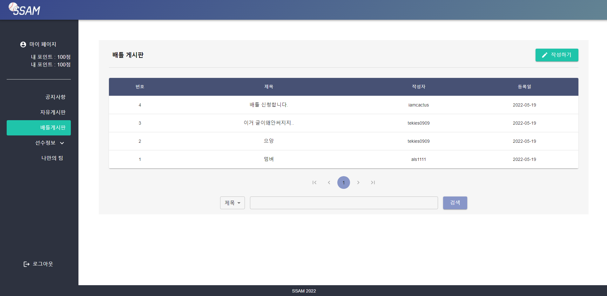

> 배틀게시판 생성

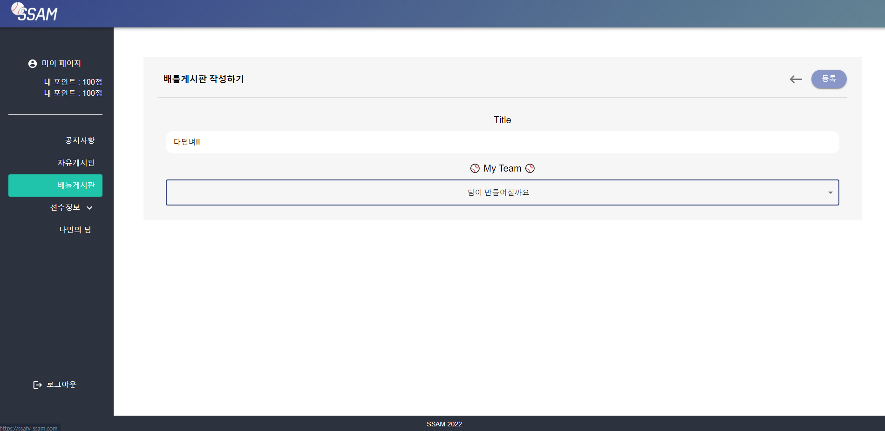

> 배틀게시판 확인

#### 3. 나만의팀 

나만의 팀을 생성 및 확인이 가능합니다.

> 나만의팀 리스트 

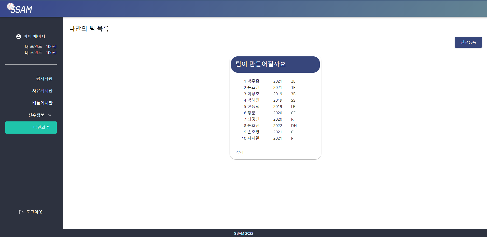

> 나만의팀 생성

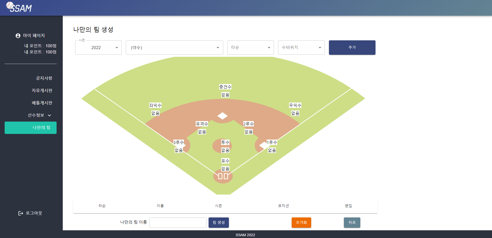

#### 4. 시뮬레이션

시뮬레이션을 진행및 결과를 확인할수있습니다.

> 시뮬레이션 시작 전 팀 선택

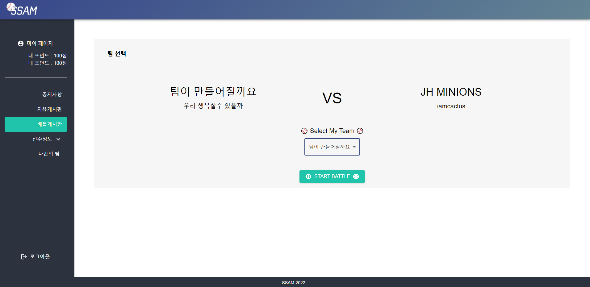

> 시뮬레이션 시작

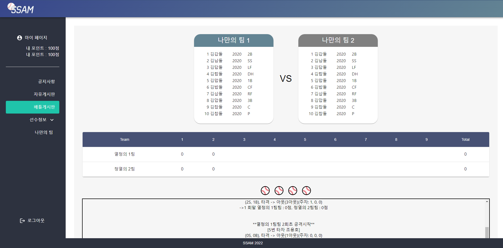

> 시뮬레이션 시작

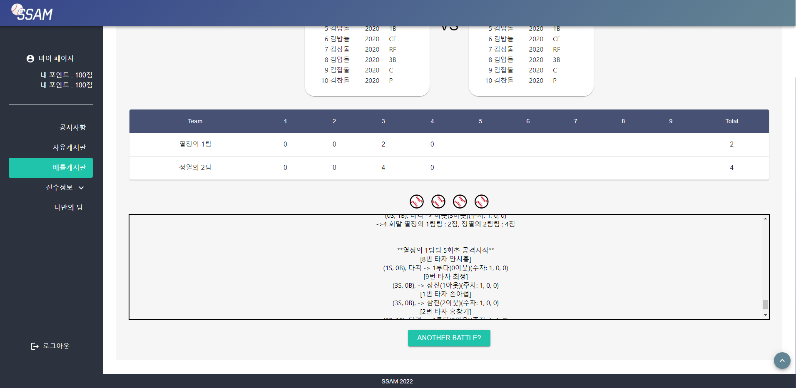

#### 5. 선수들의 스텟을 확인할수있습니다.

기록실에서 확인할수있습니다.

> 타자 정보

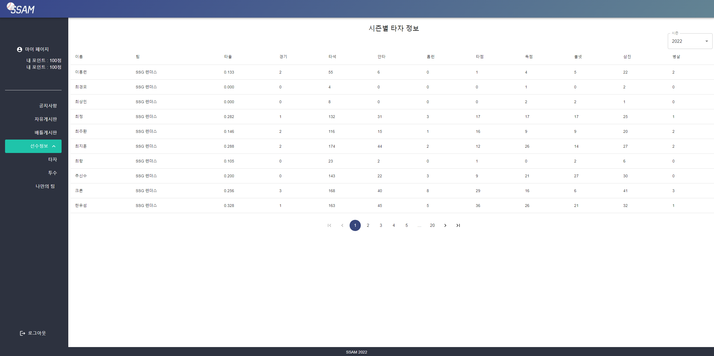

> 투수정보

